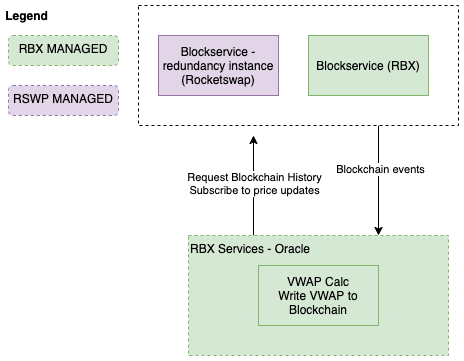

# Rubix WVAP Oracle
* Implementation of a centralised Oracle which uses a VWAP (volume weighted average price) over a predefined period.
* Motivation for implimenting this is to minimise the risk of liquidations due to short-lived fluctuations in price.

## Proposed Architecture

The application will consist of :

* Oracle instance : 
  * Calculates VWAP over previous X seconds
  * Submits value to the Blockchain
* Lamden Block Service :
  * Keeps an up to date copy of the blockchain and provides this to the Oracle.

## Deliverables
1. Working application (Presented as Github links w/ docker-compose configs)
2. Dockerised Lamden Block Service Instance & Installation guide.
3. Documentation (Operator Quick-start, Troubleshooting)
4. Swagger Interactive API Docs
5. Technical Support for functionality mentioned in deliverables.

## Requirements
#### Oracle VM
* NodeJS Application
* Calculates and submits VWAP to blockchain
  * Interval this is performed at is configurable.
* Submits VWAP to blockchain, 
  * Recovery measures if transactions are failing to the blockchain.
* Communicates with an RBX hosted instance of Lamden Block Service for blockchain state.
  * Will use Rocketswap BlockService in the event of RBX instance outage.

##### Functional Modules

* VWAP Calculation Module
* BlockService Provider - manages communication with the block-service instance, redundancy fallback strategy, syncs blockchain history
* SQLITE DB for handling oracleVM specific state.

## Technologies
* NestJS - Backend Framework
* TypeORM - DB Tool
* Docker - Deployment
* Swagger - API Explorer
* Lamden Block Service - Advanced tool for querying blockchain state.
* VWAP Library - https://github.com/miguelmota/vwap, has VWAP core tests
